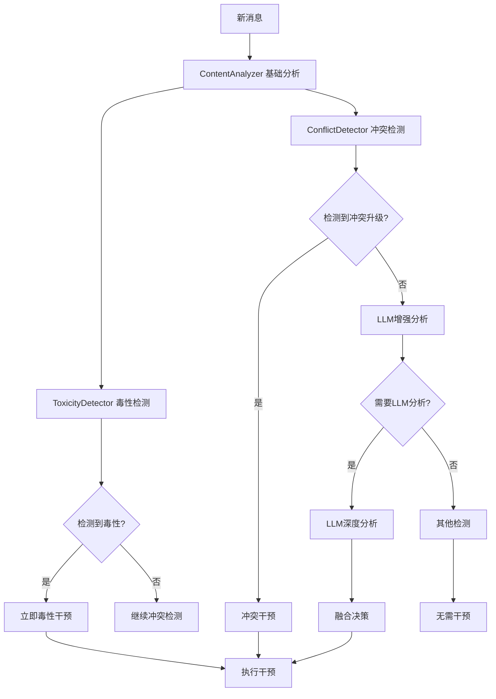

# 新版检测系统架构说明

## 🏗️ 系统概览

新版检测系统采用**分层检测架构**，明确区分毒性检测和冲突检测，提供更精确和可控的干预能力。

## 📊 核心组件

### 1. ContentAnalyzer - 内容分析器
**职责**: 基础内容分类检测
- **毒性词库**: 按严重程度分级(MILD/MODERATE/SEVERE)
- **冲突指示词**: 按类型分类(disagreement/dismissive/escalation/personal_challenge)
- **领域特定词汇**: 足球相关贬损词汇(team_slur/player_insult/fan_mockery)

### 2. ToxicityDetector - 毒性检测器
**职责**: 专门处理有害言论检测
- **零容忍模式**: 可配置是否对中等毒性立即干预
- **立即干预**: 严重毒性绕过冷却机制
- **节流保护**: 防止对同一用户重复提醒

### 3. ConflictDetector - 冲突检测器  
**职责**: 专门处理争论升级检测
- **升级风险评估**: 分析情绪强度趋势
- **交互模式识别**: 检测两人对线、群体霸凌等
- **主动预防**: 可配置是否进行预防性干预

### 4. LLMEnhancedAnalyzer - LLM增强分析器
**职责**: 处理复杂语境和边界情况
- **毒性评估**: 人身攻击、仇恨言论、粗俗语言
- **冲突评估**: 观点分歧、争论升级、敌意行为
- **上下文理解**: 意图分析、情绪识别

## 🔄 检测流程



## 🎯 检测优先级

### 优先级1: 毒性检测 (立即处理)
- **触发条件**: 检测到SEVERE或配置的毒性等级
- **处理方式**: 绕过冷却，立即干预
- **干预类型**: TOXICITY_WARNING
- **示例**: "你这个垃圾" → "@用户 请避免使用攻击性言语"

### 优先级2: 冲突检测 (上下文相关)
- **触发条件**: 升级风险为high，或medium+特定交互模式
- **处理方式**: 遵循全局冷却
- **干预类型**: CONFLICT_DEESCALATION, EMERGENCY_DEESCALATION, GENTLE_REDIRECT
- **示例**: 两人激烈对线 → "讨论有点激烈，我们放平心态"

### 优先级3: LLM增强检测 (复杂情况)
- **触发条件**: 基础分析置信度低、边界情况
- **处理方式**: 结合LLM判断，增强准确性
- **适用场景**: 隐含嘲讽、语境相关的冒犯

## ⚙️ 配置选项

### 检测模式配置
```bash
DETECTION_MODE=hybrid  # 'toxicity', 'conflict', 'hybrid'
```

### 毒性检测配置
```bash
TOXICITY_ZERO_TOLERANCE=true      # 零容忍模式
TOXICITY_IMMEDIATE_SEVERE=true    # 严重毒性立即干预
```

### 冲突检测配置
```bash
CONFLICT_MODE=proactive                # 'proactive', 'reactive', 'disabled'
CONFLICT_ESCALATION_THRESHOLD=3        # 升级检测阈值
```

### LLM增强配置
```bash
LLM_ENABLED=true                       # 启用LLM增强
LLM_CONFIDENCE_THRESHOLD=0.7           # LLM置信度阈值
LLM_MODEL=gpt-4o-mini                  # 使用的LLM模型
```

## 🔍 检测类型对比

| 特征 | 毒性检测 | 冲突检测 |
|------|----------|----------|
| **目标** | 绝对不当言论 | 相对性争论升级 |
| **标准** | 普遍适用 | 上下文相关 |
| **触发** | 立即处理 | 渐进评估 |
| **示例** | 脏话、侮辱 | 激烈反驳、情绪化 |
| **干预** | 零容忍警告 | 降温引导 |

## 📈 优势特点

1. **概念清晰**: 毒性vs冲突明确区分
2. **分层检测**: 基础→上下文→LLM增强  
3. **优先级明确**: 毒性优先于冲突
4. **可配置性**: 灵活的检测策略
5. **性能优化**: 基础检测快速，LLM按需
6. **向后兼容**: 保持现有接口不变

## 🧪 测试验证

运行测试脚本验证系统功能:
```bash
python test_new_detection.py
```

## 📝 扩展性

新架构易于扩展新的检测类型:
- 可添加新的检测器类 (如SpamDetector)
- 可扩展新的LLM分析维度
- 可配置特定领域的词库和规则

这种设计既保证了检测的准确性，又确保了系统的可维护性和扩展性。
